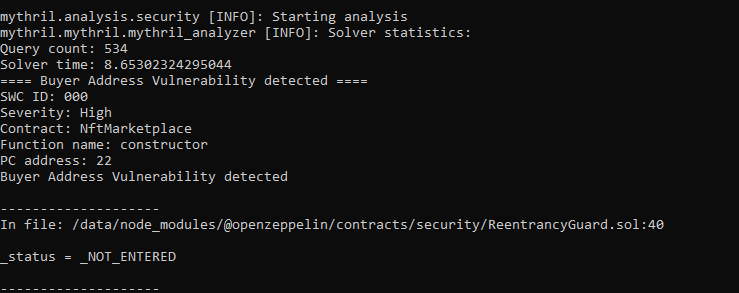
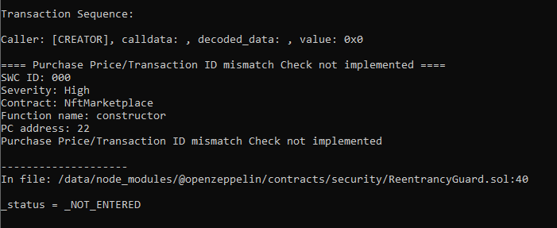
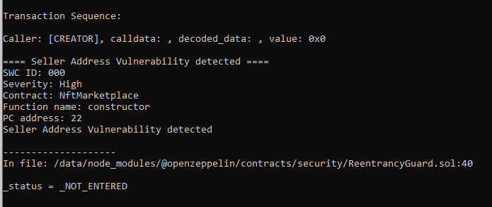
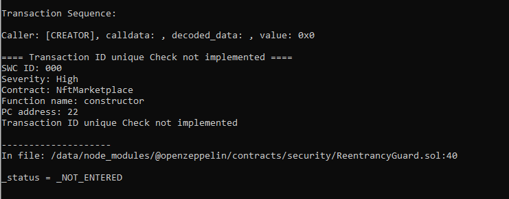
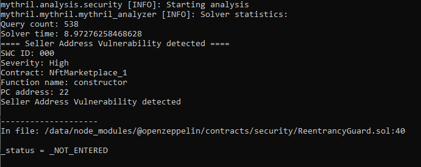

# Mythril

## Installation and setup

 ### Install docker desktop
 Docker Desktop Installation link [here](https://docs.docker.com/get-docker/).
 
**On command line: Clone custom module GitHub**
```
git clone https://github.com/KrishnaKushal/CSCE665-NFT-Mythril.git
```

**Move to the main directory with cloned files and run the command below**
```bash
$ docker build -t mythril/myth .
```

**The NFT ownership vulnerability plugin will be installed automatically after running the above command.**

## Usage Examples and Results

**Run with all vulnerabilities**

```
docker run -v $PWD/data:/data mythril/myth -v4 analyze /data/NftMarketplace.sol --solc-json /data/remapping.json
```






**Run with Seller Address Verification vulnerability**

```
docker run -v $PWD/data:/data mythril/myth -v4 analyze /data/NftMarketplace_1.sol --solc-json /data/remapping.json
```


